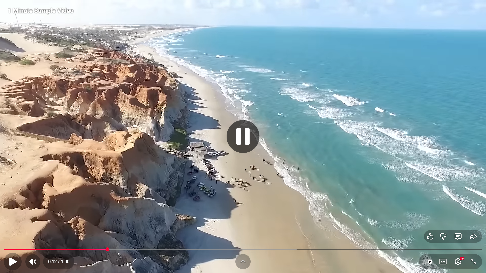
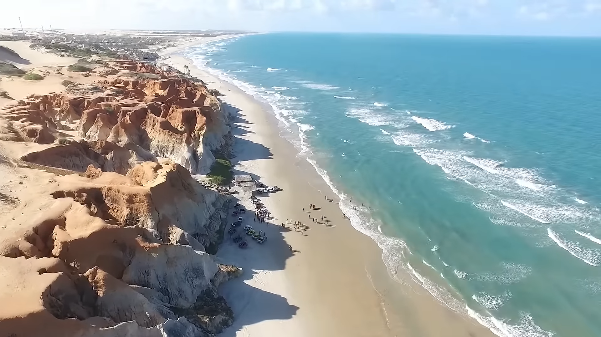

# YouTube Controls Hider

A lightweight Chrome extension that allows you to hide YouTube video controls with a simple keyboard shortcut, perfect for taking clean screenshots or recording clips without UI elements.

## Features

- 🎯 **One-click toggle** - Hide/show controls instantly with a keyboard shortcut
- ⌨️ **Easy shortcut** - Press `Ctrl+Shift+H` (Windows/Linux) or `Cmd+Shift+H` (Mac) to toggle
- 🧹 **Clean interface** - Removes all video controls, overlays, and grids
- ⚡ **Lightweight** - Minimal performance impact
- 🔒 **Privacy-focused** - No data collection, works entirely locally

## Screenshots

### Before Extension


### After Extension


## Installation

### Method 1: Install from Source (Developer Mode)

1. **Download the extension**
   - Clone this repository or download it as a ZIP file
   - If downloaded as ZIP, extract it to a folder

2. **Open Chrome Extensions page**
   - Open Google Chrome
   - Navigate to `chrome://extensions/`
   - Or click the three-dot menu → More Tools → Extensions

3. **Enable Developer Mode**
   - Toggle the "Developer mode" switch in the top-right corner

4. **Load the extension**
   - Click the "Load unpacked" button
   - Select the folder containing the extension files
   - The extension should now appear in your extensions list

5. **Verify installation**
   - You should see "YouTube Controls Hider" in your extensions
   - The extension icon will appear in your browser toolbar

6. **Verify the keyboard shortcut** (Optional)
   - The extension should automatically use `Ctrl+Shift+H` (Windows/Linux) or `Cmd+Shift+H` (Mac)
   - If the shortcut doesn't work, it may be conflicting with another extension
   - Go to `chrome://extensions/shortcuts` to verify or change the shortcut
   - Click in the shortcut field and press your desired key combination

### Method 2: Install from Chrome Web Store (Coming Soon)

_This extension will be available on the Chrome Web Store soon._

## Usage

1. **Navigate to YouTube**
   - Open any YouTube video in your browser

2. **Toggle controls**
   - Press `Ctrl+Shift+H` (Windows/Linux) or `Cmd+Shift+H` (Mac)
   - The video controls will hide/show instantly

3. **Take screenshots or record**
   - With controls hidden, capture clean screenshots or screen recordings
   - Press the shortcut again to bring controls back

## Keyboard Shortcuts

| Platform | Shortcut | Action |
|----------|----------|--------|
| Windows/Linux | `Ctrl+Shift+H` | Toggle video controls |
| Mac | `Cmd+Shift+H` | Toggle video controls |

### Customize Shortcuts (Optional)

1. Go to `chrome://extensions/shortcuts`
2. Find "YouTube Controls Hider"
3. Click the pencil icon to set your preferred shortcut

## What Gets Hidden

The extension hides:
- ✅ Video control bar (play/pause, volume, timeline)
- ✅ Video overlays (title, recommended videos)
- ✅ Fullscreen grid controls
- ✅ All YouTube UI elements over the video


## File Structure

```
hide-youtube-controls/
├── manifest.json           # Extension configuration
├── background.js          # Background service worker
├── content.js            # Content script for YouTube pages
├── images/              # Extension icons and screenshots
│   ├── logo-16.png
│   ├── logo-48.png
│   ├── logo-128.png
│   ├── before-extention.png
│   └── after-extention.png
└── README.md           # This file
```

## Troubleshooting

### Extension not working?

1. **Refresh the YouTube page** after installing the extension
2. **Check if the extension is enabled** in `chrome://extensions/`
3. **Verify you're on a YouTube video page** (not the homepage)
4. **Check the browser console** for any error messages (F12)

### Shortcut not responding?

1. **Check the shortcut** - Go to `chrome://extensions/shortcuts` and verify the shortcut is set to `Ctrl+Shift+H` (or your preferred combination)
2. **Check for conflicts** - Another extension might be using the same shortcut
3. **Try a different shortcut** - If there's a conflict, assign a different key combination
4. **Reload the extension** from the extensions page

### Controls won't hide?

1. **YouTube updated their UI** - The extension might need an update
2. **Try refreshing the page** with `F5`
3. **Check browser console** for errors

## Privacy

This extension:
- ✅ Does NOT collect any data
- ✅ Does NOT track your browsing
- ✅ Does NOT require account access
- ✅ Works entirely on your device
- ✅ Only activates on YouTube pages

## Contributing

Contributions are welcome! If you find a bug or want to add a feature:

1. Fork the repository
2. Create a feature branch (`git checkout -b feature/amazing-feature`)
3. Commit your changes (`git commit -m 'Add amazing feature'`)
4. Push to the branch (`git push origin feature/amazing-feature`)
5. Open a Pull Request

## License

This project is open source and available under the [MIT License](LICENSE).

## Support

If you encounter any issues or have questions:
- Open an issue on GitHub
- Check existing issues for solutions
- Contact the maintainer

## Changelog

### Version 1.0
- Initial release
- Basic hide/show functionality
- Keyboard shortcut support
- Chrome Manifest V3 compliance

---

**Enjoy taking clean YouTube screenshots! 📸**
